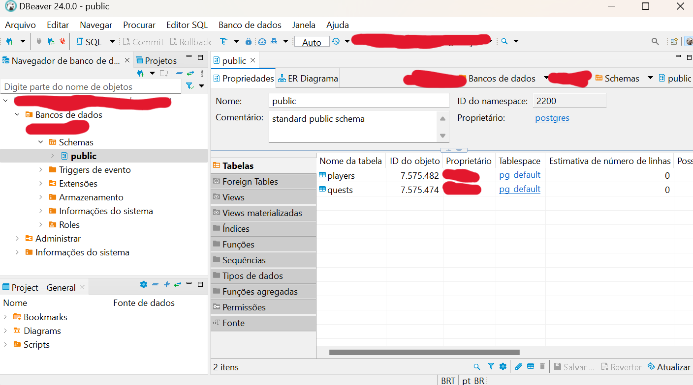

# Dragon's Dogma Missions To Do List

## Author: 

<a href="https://www.linkedin.com/in/anna-aragao/"> Anna Aragão </a>

## Summary

- [Dragon's Dogma Missions To Do List](#dragons-dogma-missions-to-do-list)
  - [Author:](#author)
  - [Summary](#summary)
- [1. Introduction](#1-introduction)
- [2. Stack](#2-stack)
- [3. Database Modeling](#3-database-modeling)
- [4. Wireframe](#4-wireframe)
- [5. Front-end](#5-front-end)
- [6. Back-end and Database](#6-back-end-and-database)
- [7. Deploy at AWS](#7-deploy-at-aws)
- [8. Integration](#8-integration)

# 1. Introduction

&nbsp;&nbsp;&nbsp;&nbsp;In the vast universe of role-playing games, immersion is essential for an engaging and rewarding experience. Dragon's Dogma, one of the most celebrated titles in this genre, offers a world filled with epic adventures and exciting challenges. However, for players looking for a meticulous organization of their quests and a better understanding of their characters, a dedicated web application could be the key to optimizing the gaming experience. In this context, the idea of a customized To Do List for Dragon's Dogma was born.

&nbsp;&nbsp;&nbsp;&nbsp;Imagine an online platform where players can not only log their missions manually, but also manage them efficiently, categorizing them into those that have already been completed, those that are in progress and those that have yet to be started. In addition, this application goes beyond simple task management, allowing users to view details of their characters within the game.

&nbsp;&nbsp;&nbsp;&nbsp;To sum up, this web application not only offers a convenient way to organize activities within Dragon's Dogma, but also provides players with a more comprehensive and detailed view of their characters, allowing them to delve even deeper into the captivating world of this renowned RPG.

# 2. Stack

1. Git: a widely used distributed version control system for managing source code during software development. It allows developers to track changes to the code, revert to previous versions and work collaboratively on projects;
   
2. GitHub: a source code hosting platform based on Git. As well as offering version control for software projects, it provides additional features such as issue tracking, continuous integration and team collaboration;
   
3. Visual Studio Code: a lightweight and highly customizable source code editor developed by Microsoft. It supports several programming languages and has a wide range of extensions to increase its functionality;
   
4. React: a JavaScript library developed by Facebook for building interactive and reactive user interfaces. It is widely used to create reusable components and build dynamic user interfaces in web applications;
   
5. Tailwind: a CSS framework that offers a utility class-based approach to styling HTML elements. It allows developers to create custom styles quickly and efficiently by combining different classes to define properties such as colors, spacing and typography;
   
6. TypeScript: a programming language developed by Microsoft that is a superset of JavaScript. It adds optional static typing and other features to facilitate large-scale software development, especially in large and complex JavaScript projects;
   
7. Node.js: an asynchronous JavaScript execution environment based on Google Chrome's V8 engine. It allows developers to create server-side applications using JavaScript, which makes it possible to build scalable and resource-efficient web applications;
   
8. Express: a web framework for Node.js that simplifies the development of web applications and APIs. It provides a variety of features for handling HTTP routes, middleware, requests and responses, making it easy to create robust and efficient web servers;
   
9. PostgreSQL: an open source relational database management system known for its reliability, robustness and support for advanced features. It is widely used in web applications and offers support for ACID transactions, indexes and referential integrity;
    
10. DBeaver: a free, universal database administration tool that supports various databases, including PostgreSQL, MySQL, Oracle and SQL Server. It provides a graphical interface for running queries, managing database schemas and visualizing data, making it easy to work with different database systems.

# 3. Database Modeling

&nbsp;&nbsp;&nbsp;&nbsp;Database modeling is a fundamental practice in the development of software systems, as it allows for the structured and efficient organization of the data that will be stored and manipulated by the system. This stage is crucial for guaranteeing data integrity, the efficiency of read and write operations, and the scalability of the system as it evolves over time.

&nbsp;&nbsp;&nbsp;&nbsp;Database modeling involves creating a conceptual, logical and physical model of the data that will be stored in the database. The conceptual model describes the entities (real-world objects such as customers, products, orders) and the relationships between them. The logical model defines the structure of the tables, columns and primary and foreign keys that will be used to represent the entities and their relationships in the database. Finally, the physical model specifies details such as data types, indexes and referential integrity restrictions, which are necessary to implement the database in a specific database management system. In this case, we have the logical model. 

<figure>
  
  <figcaption>Logical DB Model</figcaption>
</figure>

Source: Own authorship

&nbsp;&nbsp;&nbsp;&nbsp;In the "Missions" table, each record represents a game mission. Each quest is uniquely identified by an identification number (ID), which is generated automatically (serial) and serves as the primary key. In addition, each quest has a descriptive title, stored in a column of type VARCHAR with a limit of 50 characters. The "mainQuest" column is a Boolean field that indicates whether the mission is primary or secondary. Finally, the "status" column is a string that describes the current status of the mission, such as "doing" or "done".

&nbsp;&nbsp;&nbsp;&nbsp;On the other hand, the "players" table stores information about the game's players. Each player has their own record identified by a unique identification number (ID), which serves as the primary key. The player's surname is stored in a column of type VARCHAR with a limit of 50 characters. In addition, there is a column for the player's class, represented by a string with a limit of 20 characters. The player's attributes, such as level, health, attack, defense, strength, intelligence, charisma and dexterity, are all stored as integers.

# 4. Wireframe

&nbsp;&nbsp;&nbsp;&nbsp;A wireframe is a basic, schematic visual representation of a user interface, often used in the design of websites, mobile applications or other digital products. The wireframe is a kind of sketch that shows the structure of the page or screen, without including graphic details, colors or final content. In this case, we used the high-fidelity wireframe, which presents a more detailed and refined version of a traditional wireframe, with more detailed visual elements, typography and text style, functional details and more precise feedback. 

<figure>
  
  <figcaption>High-fidelity Wireframe</figcaption>
</figure>

Source: Own authorship

&nbsp;&nbsp;&nbsp;&nbsp;Here we've created a to do list to add the quests of Dragon's Dogma players. We thought of the interface with the coloring and ornamentation pattern according to the brand manual and design systems of the actual game. 

# 5. Front-end 
&nbsp;&nbsp;&nbsp;&nbsp;Frontend refers to the part of a software system that users interact with directly, i.e. the interface with which they interact. In the context of software development for the web, the frontend is the part of the application or website that is accessible and visible to end users via a web browser or mobile application. 

<figure>
  
  <figcaption>Front-end</figcaption>
</figure>

Source: Own authorship

&nbsp;&nbsp;&nbsp;&nbsp;Overall, we managed to be faithful to the high-fidelity wireframe when developing the front end with React, Typescript and Tailwind CSS. Some functionalities were added, such as the possibility of changing the mission status to "Doing" and "Done" and inserting a new mission which is automatically directed to the "To Do" column. 

# 6. Back-end and Database

&nbsp;&nbsp;&nbsp;&nbsp;The backend is the part of the software system that operates "behind the scenes" to provide functionality and support for the application's operations. It is responsible for processing, storing and managing data, as well as the application's business logic. The database, on the other hand, is an organized system for efficiently storing and retrieving information. It is designed to handle large volumes of data in a structured and secure way.

<figure>
  
  <figcaption>Database</figcaption>
</figure>

Source: Own authorship

&nbsp;&nbsp;&nbsp;&nbsp;On backend developed with Node.js and Express, the CRUD routes were made with RESTfull standardization, using the methods:

1. GET 
2. POST
3. PUT
4. DELETE

&nbsp;&nbsp;&nbsp;&nbsp;In the database developed with PostgreSQL, we store player and mission data using DBeaver. 

# 7. Deploy at AWS

&nbsp;&nbsp;&nbsp;&nbsp;The first stage was the creation of EC2 and RDS, which was integrated into EC2. After creation, we used Putty to access the machine via SSH and start the configurations. 

&nbsp;&nbsp;&nbsp;&nbsp;As the stack was different from the tutorial, we only carried out the first stage of installing and configuring apachi. 

&nbsp;&nbsp;&nbsp;&nbsp;After setting up apachi, we installed and configured Git, Node.js and the Dragon's Dogma GitHub dependencies (this repository). 

&nbsp;&nbsp;&nbsp;&nbsp;In the backend, we added the .env file to access and configure our PostgreSQL database. I ran the application on port 3000, but I also configured apachi so that every request I received in /api would be redirected to port 3000.

&nbsp;&nbsp;&nbsp;&nbsp;On the frontend, I did the build to generate the index.html and bundle.js. I copied the files to the /var/www/html folder so they would be executed in the application. 

# 8. Integration

[Demo of the services running in the AWS console, with narration describing how the deployment was performed and what each service does.](https://youtu.be/FPu4IpY06hg)

