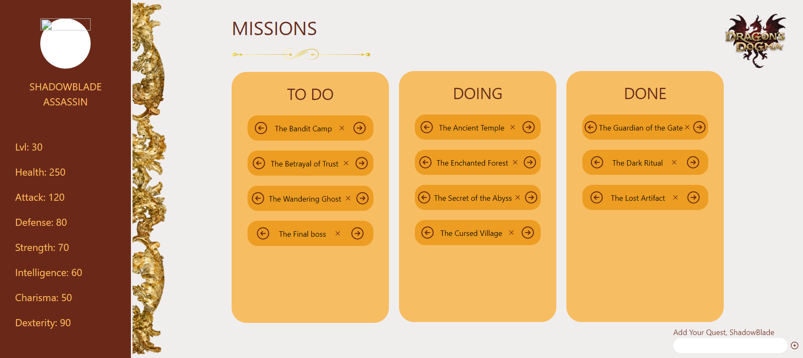

# Dragon's Dogma Missions To Do List

## Author: 

<a href="https://www.linkedin.com/in/anna-aragao/"> Anna Aragão </a>

## Summary

- [Dragon's Dogma Missions To Do List](#dragons-dogma-missions-to-do-list)
  - [Author:](#author)
  - [Summary](#summary)
- [1. Introduction](#1-introduction)
- [2. Database Modeling](#2-database-modeling)
- [3. Wireframe](#3-wireframe)
- [4. Front-end](#4-front-end)
- [5. Back-end and Database](#5-back-end-and-database)
- [6. Deploy at AWS](#6-deploy-at-aws)
- [7. Integration](#7-integration)

# 1. Introduction

&nbsp;&nbsp;&nbsp;&nbsp;In the vast universe of role-playing games, immersion is essential for an engaging and rewarding experience. Dragon's Dogma, one of the most celebrated titles in this genre, offers a world filled with epic adventures and exciting challenges. However, for players looking for a meticulous organization of their quests and a better understanding of their characters, a dedicated web application could be the key to optimizing the gaming experience. In this context, the idea of a customized To Do List for Dragon's Dogma was born.

&nbsp;&nbsp;&nbsp;&nbsp;Imagine an online platform where players can not only log their missions manually, but also manage them efficiently, categorizing them into those that have already been completed, those that are in progress and those that have yet to be started. In addition, this application goes beyond simple task management, allowing users to view details of their characters within the game.

&nbsp;&nbsp;&nbsp;&nbsp;To sum up, this web application not only offers a convenient way to organize activities within Dragon's Dogma, but also provides players with a more comprehensive and detailed view of their characters, allowing them to delve even deeper into the captivating world of this renowned RPG.

# 2. Database Modeling

&nbsp;&nbsp;&nbsp;&nbsp;Database modeling is a fundamental practice in the development of software systems, as it allows for the structured and efficient organization of the data that will be stored and manipulated by the system. This stage is crucial for guaranteeing data integrity, the efficiency of read and write operations, and the scalability of the system as it evolves over time.

&nbsp;&nbsp;&nbsp;&nbsp;Database modeling involves creating a conceptual, logical and physical model of the data that will be stored in the database. The conceptual model describes the entities (real-world objects such as customers, products, orders) and the relationships between them. The logical model defines the structure of the tables, columns and primary and foreign keys that will be used to represent the entities and their relationships in the database. Finally, the physical model specifies details such as data types, indexes and referential integrity restrictions, which are necessary to implement the database in a specific database management system. In this case, we have the logical model. 

<figure>
  
  <figcaption>Logical DB Model</figcaption>
</figure>

Fonte: [Autoria Própria]()

&nbsp;&nbsp;&nbsp;&nbsp;In the "Missions" table, each record represents a game mission. Each quest is uniquely identified by an identification number (ID), which is generated automatically (serial) and serves as the primary key. In addition, each quest has a descriptive title, stored in a column of type VARCHAR with a limit of 50 characters. The "mainQuest" column is a Boolean field that indicates whether the mission is primary or secondary. Finally, the "status" column is a string that describes the current status of the mission, such as "doing" or "done".

&nbsp;&nbsp;&nbsp;&nbsp;On the other hand, the "players" table stores information about the game's players. Each player has their own record identified by a unique identification number (ID), which serves as the primary key. The player's surname is stored in a column of type VARCHAR with a limit of 50 characters. In addition, there is a column for the player's class, represented by a string with a limit of 20 characters. The player's attributes, such as level, health, attack, defense, strength, intelligence, charisma and dexterity, are all stored as integers.

# 3. Wireframe

&nbsp;&nbsp;&nbsp;&nbsp;A wireframe is a basic, schematic visual representation of a user interface, often used in the design of websites, mobile applications or other digital products. The wireframe is a kind of sketch that shows the structure of the page or screen, without including graphic details, colors or final content. In this case, we used the high-fidelity wireframe, which presents a more detailed and refined version of a traditional wireframe, with more detailed visual elements, typography and text style, functional details and more precise feedback. 

<figure>
  
  <figcaption>High-fidelity Wireframe</figcaption>
</figure>

Fonte: [Autoria Própria]()

&nbsp;&nbsp;&nbsp;&nbsp;Here we've created a to do list to add the quests of Dragon's Dogma players. We thought of the interface with the coloring and ornamentation pattern according to the brand manual and design systems of the actual game. 

# 4. Front-end 
&nbsp;&nbsp;&nbsp;&nbsp;Frontend refers to the part of a software system that users interact with directly, i.e. the interface with which they interact. In the context of software development for the web, the frontend is the part of the application or website that is accessible and visible to end users via a web browser or mobile application.

<figure>
  
  <figcaption>Front-end</figcaption>
</figure>

Fonte: [Autoria Própria]()

&nbsp;&nbsp;&nbsp;&nbsp;Overall, we managed to be faithful to the high-fidelity wireframe when developing the front end. Some functionalities were added, such as the possibility of changing the mission status to "Doing" and "Done" and inserting a new mission which is automatically directed to the "To Do" column. 

# 5. Back-end and Database
# 6. Deploy at AWS
# 7. Integration

